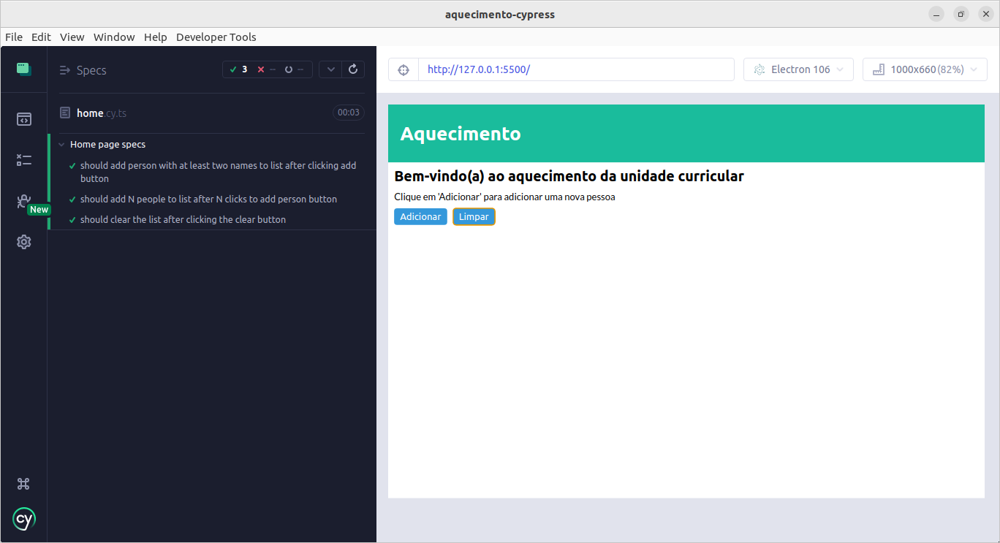

# aquecimento-cypress

## Sumário

- [aquecimento-cypress](#aquecimento-cypress)
  - [Sumário](#sumário)
  - [Motivação](#motivação)
  - [Pilha de tecnologia](#pilha-de-tecnologia)
  - [Galeria](#galeria)
  - [Como rodar](#como-rodar)
    - [Pré-requisitos](#pré-requisitos)
    - [Passo a passo](#passo-a-passo)

## Motivação

Este repositório consiste em um gerador de nomes aleatórios cujo real objetivo é exemplificar o uso do framework de teste Cypress. Por se tratar de um exemplo introdutório, foi utilizado apenas Vanilla JS para compor o site, além de HTML e CSS. Entretanto, os testes foram escritos em TypeScript.

Este foi o primeiro repositório de código apresentado no [Curso Superior de TSI do IFMS](https://www.ifms.edu.br/campi/campus-aquidauana/cursos/graduacao/sistemas-para-internet/sistemas-para-internet) como requisito para obtenção da nota parcial das atividades da unidade curricular Construção de Páginas Web IV.

| [Próximo repositório &rarr;](https://github.com/mdccg/react-cypress/) |
|-|

## Pilha de tecnologia

As seguintes tecnologias foram utilizadas para desenvolver este app, além de HTML e CSS:

| Papel | Tecnologia |
|-|-|
| Ambiente de execução | [Node](https://nodejs.org/en/) |
| RNG | [Faker](https://fakerjs.dev/) |
| Linguagem de programação | [TypeScript](https://www.typescriptlang.org/) |
| Framework de teste | [Cypress](https://www.cypress.io/) |

## Galeria



## Como rodar

### Pré-requisitos

- [Node](https://nodejs.org/en/download/);
- [Yarn](https://yarnpkg.com/) (opcional);
- [`http-server`](https://npmjs.com/package/http-server) ou quaisquer ferramentas de servidores HTTP estáticos.

### Passo a passo

1. Clone o repositório de código em sua máquina;

2. Abra um shell de comando de sua preferência (prompt de comando, PowerShell, terminal _etc_.);

3. Instale as dependências do projeto através do seguinte comando:

```console
$ npm install
```

Caso esteja utilizando o gerenciador de pacotes Yarn, execute o seguinte comando como alternativa:

```console
$ yarn
```

4. A próxima etapa é disponibilizar o seguinte projeto em um servidor HTTP estático. Como sugestão, você pode usar o módulo do npm [`http-server`](https://npmjs.com/package/http-server), que pode ser instalado globalmente via npm ou Yarn e subirá um servidor na porta `8080` visível para toda a sua rede. Sinta-se à vontade para utilizar uma ferramenta de sua preferência, mas não se esqueça de atualizar a propriedade `baseUrl` no arquivo [`cypress.config.ts`](./cypress.config.ts);

5. Execute o Cypress através do seguinte comando:

Para npm:

```console
$ npm run cy:open
```

Para Yarn:

```console
$ yarn cy:open
```

6. O comando acima abrirá uma janela do Cypress solicitando que selecione o tipo de teste: E2E (teste de ponta a ponta) e Component (teste de componente). Neste projeto, não foram escritos testes de componente. Portanto, selecione a opção E2E;

7. Selecionada a opção E2E, será solicitado que selecione um navegador web para executar os testes. É recomendado selecionar o navegador Electron, pois o mesmo foi desenvolvido pelo time do framework Cypress e contém ferramentas integradas que podem colaborar com a escrita dos testes unitários;

8. Selecionado o navegador web, os testes unitários serão apresentados por diretório para que você os selecione para que sejam executados.